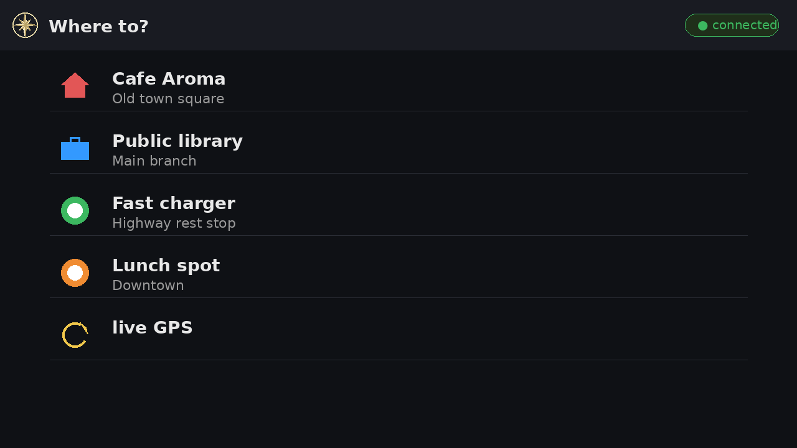

# CarMenu

A minimal **server-driven Android Auto** viewer. Posts your current
location to an HTTPS endpoint you configure, renders the JSON response
as one of three Android Auto templates (List / Pane / Message), and
fires navigation/dial intents on row taps.

The app is intentionally tiny: two permissions, no background service,
no third-party SDKs, ~1 000 lines of Java. The interesting logic lives
on **your** server.

| | |
|-|-|
|  | Compass-rose adaptive icon, navy + cream. |



## Why?

Android Auto's built-in app categories are tightly restricted. Most
useful workflows — "show me the route home with current traffic", "call
the person I'm meeting", "navigate to the nearest charger that's not
full right now" — require server-side logic that the standard Maps/Waze
flows can't express. CarMenu is the smallest viable shell that lets
your own server drive the AA screen.

## How it works

```
                          POST /aa-screen
              ┌────────────────────────────────────┐
              │  {device_id, lat, lon, ts, ...}    │
              ▼                                    │
  ┌──────────────────┐         ┌──────────────────────┐
  │  CarMenu (this)  │         │  Your HTTPS server   │
  │  one Screen      │◀────────│  (the brain)         │
  │  AA template     │  JSON   │                      │
  └──────────────────┘         └──────────────────────┘
       │  user taps row
       ▼
  startCarApp(parseIntent(row.tap))
       │
       ▼  e.g. geo:52.5163,13.3777?q=52.5163,13.3777
  Waze / Google Maps takes over navigation
```

Full HTTP/JSON spec: **[`docs/PROTOCOL.txt`](docs/PROTOCOL.txt)** (also
bundled inside the APK — open CarMenu on the phone → "View / save
protocol spec").

## Repo layout

| Path | What |
|------|------|
| `app/` | Android Studio project (Java, ~1k LOC) |
| `app/src/test/` | 46 JVM unit tests (no emulator needed) |
| `docs/` | Protocol spec, build/install notes, Play submission notes |
| `assets/store/` | Play Store listing assets (icon, feature graphic, descriptions, privacy policy) |
| `server-example/python/` | Reference Flask server, ~150 lines, full protocol coverage |
| `Makefile` | Build / install / DHU / OTA / keystore helpers |
| `LICENSE` | MIT |

## Quick start

### Build & install the app

```sh
git clone https://github.com/Mirarkitty/android-auto-car-menu.git
cd android-auto-car-menu
make debug          # build app/build/outputs/apk/debug/app-debug.apk
make install        # adb install -r the debug APK
```

Then on the phone, open the **CarMenu** launcher icon and enter your
server URL. See [`docs/BUILD.md`](docs/BUILD.md) for the full setup,
including the Android Auto Desktop Head Unit (DHU) for testing without
a car.

### Run the reference server

```sh
cd server-example/python
python3 -m venv .venv && source .venv/bin/activate
pip install -r requirements.txt
python3 carmenu_server.py        # http://0.0.0.0:8080
```

Set the phone's CarMenu server URL to
`http://<your-laptop-ip>:8080/aa-screen`. See
[`server-example/python/README.md`](server-example/python/README.md)
for details.

### Run the unit tests

```sh
make test           # ./gradlew testDebugUnitTest
```

46 JVM-only tests covering the JSON parser, intent classifier,
URL same-origin guard, tint parser, etc. No emulator or device needed.

## Privacy & permissions

Two permissions, no background service:

- **`ACCESS_FINE_LOCATION`** — sent only to the server URL the user
  configured. Read only while the AA screen is visible.
- **`INTERNET`** — to talk to that server.

That's it. No analytics SDK, no crash reporter, no advertising library,
no Bluetooth, no contacts. See
[`assets/store/privacy-policy.html`](assets/store/privacy-policy.html).

## What the server can send

- **List template** — up to 6 rows, each with a title, optional
  subtitle, icon (built-in slug or remote bitmap), tint, and a tap
  intent.
- **Pane template** — up to 4 rows + up to 2 action buttons.
- **Message template** — a single screen for status / error / "permission
  denied please fix" / etc.

Icons can be one of 16 bundled vector slugs (`home`, `work`, `charging`,
`lunch`, …) or a remote bitmap URL. Remote URLs are restricted to the
**same origin** as the configured server — a security boundary so a
compromised server can't make your phone fetch from third parties.

Tints accept named colors (`red`, `green`, `blue`, `yellow`,
`primary`, …) or hex (`#RRGGBB` / `#AARRGGBB`).

Tap intents are passed through to Android Auto's `startCarApp()`
verbatim, so the server operator chooses what to dispatch. AA itself
gates what actually launches — typically `geo:` for navigation,
`tel:` for the dialer.

## Roadmap

- Server-supplied Pane images (`image_url` is parsed but not yet
  rendered).
- Optional bearer-token auth in the request header.
- More reference server implementations (PRs welcome).

## Status

The app builds at `compileSdk = 36`, `targetSdk = 36`. The reference
endpoint and apserver-integration tests are kept green together with
the Android-side JUnit tests. Currently in **internal testing** on
Google Play; production rollout pending.

## License

[MIT](LICENSE).
